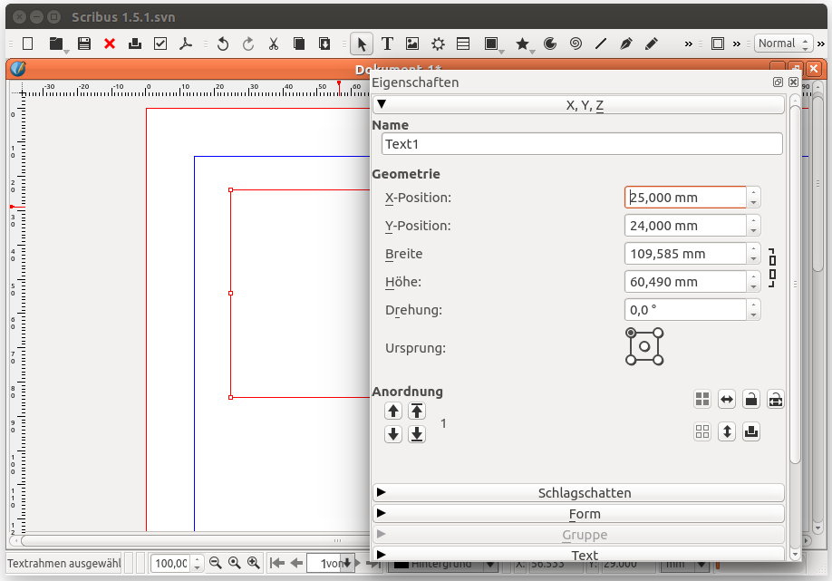

# Scribus Community-Newsletter, Oktober 2015

Das ist den erste monatliche Newsletter der Scribus-Community betreffend Scribus und seiner Entwicklung.

Der Schwerpunkt dieser Ausgabe sind die neu gestalteten Icons in der Version 1.5.1svn und die neuen Kommandozeile-Features, die es ermöglichen, Dateien per Skript zu bearbeiten sowie PDFs zu erzeugen. 

## Ein neuer Satz von Piktogrammen

Vor einigen Monaten hat die Scribus Entwickler-Version einen Satz neuer Icons erhalten.



Deszo Markon, der diese neuen Zeichen kreiert, ist ein neu zu uns gestossener Entwickler. Auch wenn dieser Satz noch nicht zu 100% fertiggestellt ist, deckt er bereits mehr als 80% der Icons ab. Das Design kommt mit wenigen Farben aus, ist am Anfang etwas gewöhnungsbedürftig, es bring aber auch eine sehr erfrischend neue konsequente visuelle Einheit.

Während der Integration dieser Piktogramme hat Craig Bradney, einer unserer langjährigen Entwicklern, sich die Zeit genommen, die Themenauswahl in Scribus zu verstärken: man kann nun  aus verschiedenen Icon-Sammlungen auswählen. Somit kann der Anwender seine grafische Oberfläche besser personalisieren, dazu kommt dass es für Grafiker einfacher wird, neue Icon-Sets zur Verfügung zu stellen.

Möchtest Du das ausprobieren?

1.	Installiere eine Scribus-Version, die im Juli 2015 oder später gebaut wurde:
	- Linux: Scribus selber kompilieren, resp. das PPA für Ubuntu installieren.
	- Mac: Installieren via Homebrew oder Scribus 1.5.1 installieren, sobald es veröffentlich ist.
	- Windows: Du musst die Veröffentlichung der Version 1.5.1 abwarten.
2.	Gehe zu „Datei“ > „Allgemeine Einstellungen...“
3.	Unter „Benutzeroberfläche“ das Thema "Scribus 1.5.1" auswählen.
4.	Scribus neu starten.

### Deszo Markon: der Designer hinter den neuen Piktogrammen

Deszo Markon lässt sich gerne zum neuen "1.5.1" Icon-Set interviewen:

_Bitte stelle Dich der Scribus Community vor..._

Ich bin Designer, lebe in Rumänien in Transylvanien und bin ungarischer Nationalität. Ich verwende Linux bereits seit 20 Jahren. Gegenwärtig habe ich Arch und Xfce installiert.

_Was hat Dich dazu motiviert, gerade an diesem Free Libre Open Source Projekt mitzuarbeiten?_

2006 als wir unsere Firma (<http://www.vitaking.ro/>) gegründet haben, war es meine Aufgabe den ersten Verkaufskatalog mit allen Vitaminprodukten zu produzieren. Dazu wollte ich Linux verwenden, musst jedoch bald einsehen, dass die damals vorhandenen Programme nicht für professionelles Desktop-Publishing verwendbar waren. Also wurde der Katalog mit Windows-Software produziert. Allerdings war ich etwas enttäuscht und so suchte ich nach Möglichkeiten den Arbeitsablauf unter Linux zu realisieren.

Unser zweiter und dritter Katalog wurden dann unter Linux erstellt; allerdings mussten die Bilder und Vektoren nach wie vor mit Adobe-Software erstellt werden.

Endlich, 2013 nach vielen Rückschlägen  und Fehlern, gelang es mir einen akzeptablen Arbeitsablauf unter Linux zu haben.Die Fotos wurden durch 3D-Bilder ersetzt, für die Blender verwendet wird, die Vektorgrafiken werden in Inkscape erstellt, für die Post-Produktion wird Krita angewendet und zusammengestellt wird alles in Scribus. Ich verwende Scribus 1.5.0svn, da die eigentliche stabile Version noch Probleme mit dem PDF hat. Obwohl die 1.5.0svn offiziell als «nicht-stabil» bezeichnet wird, ist sie sehr stabil. Wir hatten nie Probleme oder Abstürze mit ihr, trotzdem wir tagtäglich mit dieser Verson arbeiten.

Meine Motivation bei Scribus mitzuhelfen ist ganz einfach: Ich möchte der Community die es mir ermöglicht hat, einen DTP-Workflow auf Linux zu verwenden, etwas zurückgeben. Scribus hat grosses Potential, es ist ein starkes Seiten-Gestaltungsprogramm. Leider ist die grafische Oberfläche, das Interface, noch nicht so, dass diese Eigenschaften zum Ausdruck kommen und am Anfang grosses Vertrauen erwecken. Jedes mal, wenn ich in der Desktop-Publishing-Welt das Programm vorführte, kam unweigerlich der Kommentar «Was ist das? Es sieht nach nichts aus, das werde ich nie für meine Projekte verwenden». Der Grund ist klar, wenn man eine Applikation zum ersten Mal öffnet, zählt eben der erste Eindruck und das ist die Eröffnungsseite. Wenn dieses User-Interface nicht professionell aussieht, benötigt man schon starke Argumente, z.B. ein überzeugter Linux- oder Scribus-Fan zu sein. Oder jemanden zu haben, der die Feinheiten und Professionalität demonstrieren kann.

So habe ich mich dazu entschlossen, diesen Teil zu verbessern und begann mit meinem neuen Piktogramm-Set. Anfangs haben wir diese Icons nur intern verwendet, wurden dann bald nachdem ich einige Bildschirmfotos in Foren veröffentlich habe, angefragt, ob dieser Satz auch verwendet werden könnte. So habe ich den Satz unter der Lizenz GPLv2 freigegeben, der dann kurz darauf in Scribus 1.5.1 aufgenommen wurde.

_Was sind Deine Ideen und Ansprüche hinter dem neuen Thema?_

Ich hatte keine Inspiration für den Set. Ich wollte von Anfang an etwas Einfaches und Unaufdringliches wie möglich. Meiner Meinung nach sind die bestehenden Icons zu kompliziert geworden. Es ist halt nicht immer möglich, gleich alles in einem 16x16 Pixel Bildchen zu zeigen. Wer das trotzdem macht, hat dann Bilder die wegen Überfüllung nichts mehr aussagen, und so verlieren sie den Sinn total. Daher habe ich mich entschlossen, diese Gestaltungen zu vereinfachen und etwas zu bieten, das nicht im Wege steht und einfach zu merken ist.

_Wie können  Leute ebenfalls mithelfen?_

Bis jetzt hatte ich noch keine Rückmeldungen zu diesen Icons. Es wäre gut und nützlich, wenn Anwender mir konstruktive Kritik geben könnten. Es hat immer Platz für Verbesserungen, ich bin gerne bereit nützliche Ideen in meiner Arbeit anzuwenden.

_Wohin sollte Deiner Ansicht nach die Entwicklung des UI von Scribus führen und wie sollte das professionell gemacht werden?_

Ich sehe das Interface als sehr individuell einrichtbar. Eben sehr professionell. Etwas das das Potential der Software wirklich zum Ausdruck bringt. Ich plane, mich selber noch mehr zu involvieren und lerne im Moment GIT und SVN, so dass ich direkt und effizient mit den Repositories arbeiten kann.

## Scribus auf der Kommandozeile

Schon lange (erste Spuren lassen sich im [im Bugtracker Anfang 2004](http://bugs.scribus.net/view.php?id=238) finden) wurde danach gefragt, Scribus auf der Kommandozeile (CLI) laufen zu lassen. Es wurde ein Weg gesucht, die Arbeit mit Skripten zu automatisieren, erstellte Dokumente zu verwalten und druckfertige PDF-Dokumente zu erstellen.

Über die Jahre - viele Möglichkeiten wurden ausprobiert - wurden viele Patches geschrieben, aber keiner davon schaffte es in den Haupt-Code von Scribus.

Dank Juraj Fedel und William Bader wurden letztes Jahr eine Reihe von Patches ([der wichtigste war derjenige mit dem --python-script Befehl](http://bugs.scribus.net/view.php?id=12572)) eingereicht, die die Funktion, ein Pythonskript beim Start von Scribus zu starten und dann zu beenden, bereitstellen. Die Patches wurden akzeptiert und in Scribus integriert!

Was bedeutet das? Zum Beispiel ist es jetzt möglich, Skripte zu schreiben, die auf der Kommandozeile ein PDF erzeugen:

```python
import scribus
scribus.openDoc('the-document.sla')
pdf = scribus.PDFfile()
pdf.file = 'the-pdf.pdf'
pdf.save()
```

Ausführen:

```sh
$ scribus --python-script to-pdf.py
```

Und man bekommt ein PDF-Dokument, das man an die Druckerei schicken kann.

Es wurden noch mehr Patches vorgeschlagen und akzeptiert - hauptsächlich um Dialogboxen zu entfernen, wenn man ohne grafische Oberfläche mit Scribus arbeitet.

[@Berteh](http://github.com/berteh) machte einen weiteren Schritt. Während der letzten Monate arbeitete er an einem [Patch](http://bugs.scribus.net/view.php?id=13311), der es erlaubt, dem Pythonskript Parameter mitzugeben. Nun kann man das Skript oben so erweitern, dass es das "text"-Argument akzeptiert. So kann man den Inhalt eines bestimmten Felds ersetzen und ein angepaßtes PDF erstellen.

```sh
$ scribus --python-script to-pdf.py --python-arg text "Welcome to Scribus" the-document.sla
```

Wenn man mehrere Parameter benötigt, ist es natürlich wahrscheinlich, dass man dynamisch eine JSON/CSV-Datei erstellt, ihren Pfad als Parameter mitgibt und das Pythonskript die Daten verarbeiten und vielfache Felder im Scribus-Dokument ausfüllen läßt.

Wir können nun sagen, dass Scribus jetzt Daten im Stapelbetrieb verarbeiten kann. Aber es ist immer noch ein langer Weg bevor es als Server-Tool glänzen kann! Wenn es von der CLI aufgerufen wird, startet es immer noch die grafische Oberfläche (man sieht nur ein Aufblitzen), es wurden noch nicht alle Dialogboxen ausgeschaltet und es fehlen einige sehr hilfreiche Befehle in der Scripter API.

Wenn Du mehr über dieses neue Feature lernen willst - es gibt schon eine Einführung mit viel mehr Einzelheiten im Wiki:
<http://wiki.scribus.net/canvas/Command_line_scripts>

## Testimonials

[](https://twitter.com/pinstripeowl/status/643853781512384512)

(Auf Englisch wird ein Auschnitt aus Dracula als Fülltext gebraucht.)

[](https://twitter.com/garrett/status/643733124799590401)

[](https://twitter.com/ArcoMul/status/633352668023529472)

[](https://plus.google.com/b/109612024486187515483/109612024486187515483/posts/ESXgERV2A2H)

## Mach mit! / Aufruf zum Mitwirken

### Wir suchen einen Webgestalter für den Scribus Community Asknot

Letztes Jahr haben wir einen Fork von  <http://www.whatcanidoformozilla.org> gestartet. Es handelt sich um eine PR-Webseite wo unsere Freiwilligen lernen können wie sie unser Projekt unterstützen können.

Der momentane Stand kann auf Github eingesehen werden:  
<https://github.com/scribusproject/asknot>

Wir suchen vor allem Hilfe für folgende Punkte

- Webdesigner/in der/die uns hilft das ganze auf Scribus anzupassen
- Übersetzer
- alle, die uns auf andere Weise behilflich sein möchten.

### Neustart (wieder einmal) für den neuen Scripter

Ein neuer Scripter ist seit längerer Zeit in Arbeit. Momentan stecken wir bei der Portierung der neuen Engine von Qt4 nach Qt5 fest, insbesondere am Punkt wo wir das reale Signal und Slots über die Grenzen zwischen C++ und Python unter Verwendung von PyQt5 zu verbinden haben.

Der aktuelle Code für den neuen Scripter befindet sich auf Github  
<https://github.com/aoloe/scribus-plugin-scripter>

Eure Hilfe ist uns sehr wertvoll und wissen wir es zu verdanken. Wer denkt, dass er uns helfen kann, soll sich bitte via dem Issue Tracker auf dem Repository oben melden.


## Über dieser Newsletter

Dieser Scribus-Newsletter wird von aktiven Helfern der Scribus-Community herausgegeben.  
Unser Ziel ist eine Ausgabe pro Monat mit unterschiedlichen Gesichtspunkten der Scribus-Welt.

Die Oktober-Ausgabe wurde von Ale und Kunda verfasst.  
Die deutsche Übersetzung ist von Arran, Julius und Laser87.

Du kannst auch via unserem Github-Repository beitragen (<https://github.com/aoloe/scribus-newsletter>) oder via Foren, IRC, Mailing Listen, Twitter, E-Mail, etc.

Wir suchen weitere Redakteurinnen und Redakteure (Artikel können auch auf Deutsch eingereicht werden!), Übersetzer und eine(n) GrafikerIn für eine ansprechendere Gestaltung dieses Newsletters.  
Wir würden uns auch freuen, wenn Grafiker, abwechselungsreiche PDF-Versionen des Newsletter gestalten würden.

Wir sind auch für Vorschläge mit neuen Themen offen, einfach den [Tracker für die nächste Ausgabe](https://github.com/aoloe/scribus-newsletter/issues/7) verwenden.

Dieses Bulletin wurde unter einer Creative Commons Lizenz veröffentlicht:  
CC-BY-SA, der Scribus-Community Newsletter (http://impagina.org/newsletter)
