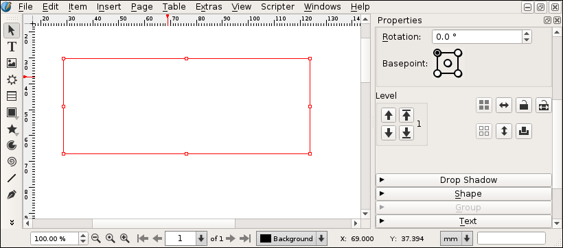
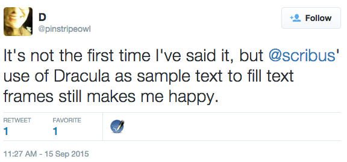
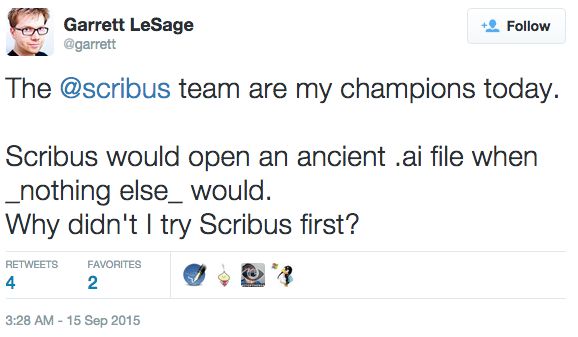
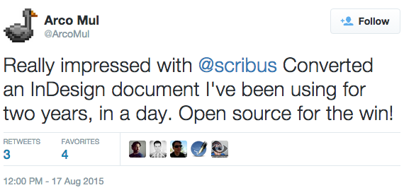
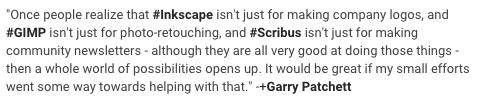

# La Newsletter della comunità di Scribus, Ottobre 2015

Eccovi il primo numero della newsletter redatta dalla comunità di Scribus.

I temi trattati in questo mese sono il nuovo set di icone in Scribus 1.5.1.svn e le nuove funzionalità per la manipolazione di documenti e la produzione di PDF da linea di comando.

## Il nuovo set icone

Recentemente è stato aggiunto un nuovo set di icone alla versione di sviluppo di Scribus.



Questo nuovo set di icone è stato creato da Dezso Markon, nuovo contributore, e, sebbene non sia completo al 100%, copre già più dell'80% delle icone esistenti.
Nonostante la semplice scelta cromatica si discosti nettamente dal precedente set di icone, è stato mantenuto un design coerente e piacevole in tutta la sua progettazione.

Durante il processo di integrazione del nuovo set di icone, Craig Bradney, uno degli sviluppatori storici di Scribus, si è occupato di migliorare la capacità di gestione delle icone in Scribus. Quindi, in futuro, i graphic designer avranno la possibilità di proporre con maggiore semplicità nuovi set di icone e gli utenti potranno scegliere con un click!

Vuoi dare un'occhiata alle nuove icone?

1. Scarica una versione di Scribus compilata con codice sorgente successivo a luglio 2015:
  - Su Linux è possibile compilare Scribus o scaricarlo dal PPA per Ubuntu
  - Su Mac è possibile [installarlo con Homebrew](https://github.com/scribusproject/homebrew-scribus/) o [scaricare Scribus 1.5.1](http://www.scribus.net/downloads/unstable-branch/) appena sarà disponibile.
  - Su Windows sarà necessario attendere il rilascio di [Scribus 1.5.1](http://www.scribus.net/downloads/unstable-branch/).
2. Apri "File > Preferenze..."
3. Sotto "Interfaccia utente > Finestra principale" scegli il tema "Scribus 1.5.1"
4. Riavvia Scribus


### Dezso Markon: il designer che ha ideato il nuovo set di icone

Dezso Markon, il designer del nuovo set di icone per 1.5.1 ha gentilmente accettato di partecipare ad una breve intervista:

_Presentati alla comunità di Scribus..._

Mi chiamo Dezso Markon, sono un designer, vivo in Romania, Transilvania, e sono di origine ungherese. Utilizzo Linux da vent'anni, attualmente la distribuzione Arch con ambiente desktop Xfce.

_Cosa ti ha motivato a contribuire ad un progetto Free Libre Open Source?_

Nel 2006, quando fondammo la nostra azienda (<http://www.vitaking.ro/>), il mio lavoro era quello di produrre il primo catalogo contenente i prodotti di vitamine in vendita. Iniziai a lavorare in ambiente Linux, ma dopo un paio di giorni realizzai che le applicazioni di desktop publishing su Linux non fossero ancora mature. Così, il nostro primo catalogo fu progettato su Windows. Rimasi infastidito da questo fallimento, così iniziai a cercare una soluzione al problema "Come creare un valido metodo di lavoro su Linux?"

Il nostro secondo e terzo catalogo furono progettati con Scribus, ma la preparazione delle immagini e delle illustrazioni vettoriali necessitava ancora del pacchetto proprietario di Adobe.

Finalmente, nel 2013, dopo molte prove ed errori riuscii a completare tutto il lavoro di desktop publishing su Linux. Le immagini furono sostituite da immagini 3D create con Blender; per qualche piccola modifica usammo Krita; le illustazioni vettoriali con Inkscape ed infine, con Scribus, la progettazione a l'assemblazione del catalogo con tutti questi elementi. Usavo la versione SVN (non stabile) di Scribus 1.5.0, che tuttavia si era dimostrata piuttosto stabile. Non abbiamo mai avuto crash inaspettati o altri problemi ed ora lo utilizziamo quotidianamente.

Il motivo che mi ha spinto a contribuire a Scribus è semplicemente la volontà di restituire qualcosa alla comunità che ha reso possibile il desktop publishing su Linux. Scribus ha un grande potenziale, è un potente software di layout, ma l'interfaccia non trasmette molta confidenza. Ogni volta che lo mostravo a qualcuno nell'industra del desktop publishing, la prima impressione era "Cos'è questo? Non assomiglia a qualcosa che userei per i miei progetti." Il motivo di ciò è semplicemente il fatto che l'interfaccia, essendo la prima componente visibile di una applicazione, lascia un'impressione all'utente. Se l'interfaccia non appare professionale, sarà difficile iniziare ad usare un software senza una forte motivazione, come l'interesse verso Linux o Scribus, oppure la conoscenza approfondita delle funzionalità del software per mezzo di qualcuno.

Quindi ho deciso di provare a migliorare l'interfaccia lavorando ad un nuovo set di icone. All'inizio lo usammo esclusivamente nella nostra azienda, ma dopo aver postato alcuni screenshot in un forum, fui contattato immediatamente per avere il permesso di utilizzare le icone in Scribus 1.5.1. Accettai e rilasciai le icone sotto la licenza GPL v2 e successivamente fu aggiunto a Scribus.

_Cosa ti ha ispirato nella creazione del nuovo tema?_

Non ho avuto subito un'ispirazione chiara per le icone, ma volevo creare qualcosa di semplice che non fosse eccessivamente elaborato. Ritengo infatti che l'attuale set di icone cerchi di rappresentare tutto, anche eccessivamente, quindi alcune icone divengono troppo complesse. A volte non è possibile mostrare tutto in un'area di 16x16 pixel. Si otterrà un'icona troppo piena di elementi, rendendo complicata l'associazione dell'icona alla funzione perchè contiene troppe informazioni. Quindi ho semplificato le icone, tenendo presente l'importanza del riconoscere e ricordare le icone.

_Come possono le persone contribuire al progetto?_

Al momento non ho avuto alcun feedback sulle icone. Quindi apprezzerei molto ricevere un feedback costruttivo. Infatti, si può sempre migliorare un progetto e sarei contento di applicare utili consigli al mio lavoro.

_Come vorresti che l'interfaccia di Scribus si evolvesse e quali sono le tue proposte?_

Vorrei vedere un'interfaccia grafica altamente personalizzabile e professionale, un risultato che rifletta e comunichi le potenzialità del software. In futuro ho in programma di partecipare nuovamente in quest'area di Scribus e sto imparando ad utilizzare GIT e SVN per poter essere in grado di lavorare in modo diretto ed efficiente con le repository.


##Scribus da linea di comando

Da molto tempo (le prime richieste si possono trovare [nel nostro bug tracker già all'inizio del 2004](http://bugs.scribus.net/view.php?id=238)), gli utenti richiedevano funzionalità da riga di comando (CLI) per Scribus. Cercavano un metodo per automatizzare il loro lavoro nell'elaborazione, generazione e produzione di file PDF pronti per la spedizione in stampa.

In questi anni, nonostante i parecchi sforzi e le varie patch scritte, nessuna di queste è mai entrata a far parte del codice di Scribus.

L'anno scorso, Juraj Fedel e William Bader, hanno presentato una serie di patch ([la più importante riguardo l'aggiunta del comando --python-script](http://bugs.scribus.net/view.php?id=12572)) che hanno aggiunto la funzionalità per avviare uno script Python all'avvio di Scribus e successivamente uscire. Le patch sono state accettate e ora sono parte di Scribus!

Quali vantaggi ha portato ciò? Ora, per esempio, è possibile scrivere script che generano file PDF da linea di comando:

```python
import scribus
scribus.openDoc('documento.sla')
pdf = scribus.PDFfile()
pdf.file = 'file.pdf'
pdf.save()
```

ed eseguirlo:

```sh
$ scribus --python-script to-pdf.py
```

per ottenere un file PDF che puoi inviare in stampa.

Altre patch hanno rimosso la necessità di avviare l'interfaccia per eseguire gli script.

[@Berteh](http://github.com/berteh) ha contribuito a portare avanti l'obiettivo. Negli ultimi mesi ha lavorato su una [patch](http://bugs.scribus.net/view.php?id=13311) che permettesse di utilizzare parametri con gli script python. Ora è possibile migliorare lo script precedente in modo da accettare l'argomento "text", utilizzalo per sostituire il contenuto di uno specifico form e creare un PDF personalizzato:

```sh
$ scribus --python-script to-pdf.py --python-arg text "Welcome to Scribus" the-document.sla
```
Ovviamente, quando si ha bisogno di più parametri è probabile che si crei dinamicamente un file JSON o CSC, lo si passi come parametro e si lasci lo scrip Python processare tutti i dati e riempire i vari campi nel documento Scribus.

Ora possiamo dire che Scribus è in grado di processare file batch. Mancano tuttavia ancora molti accorgimenti prima che possa eccellere come strumento server! Attualmente l'esecuzione da CLI avvia parte dell'interfaccia grafica (si vede solamente un istante), non tutte le finestre sono state disattivate e molti comandi utili non sono ancora disponibile nelle API dello Scripter.

Per ulteriori informazioni su questa nuova funzionalità,  ulteriori dettagli aggiuntivi sono presenti nel nostro wiki:

<http://wiki.scribus.net/canvas/Command_line_scripts>


## Testimonial

[](https://twitter.com/pinstripeowl/status/643853781512384512)

[](https://twitter.com/garrett/status/643733124799590401)

[](https://twitter.com/ArcoMul/status/633352668023529472)

[](https://plus.google.com/b/109612024486187515483/109612024486187515483/posts/ESXgERV2A2H)

## Richieste di partecipazione

### Cerchiamo un web designer per un Asknot della comunità di Scribus

L'anno scorso abbiamo avviato un fork di <http://www.whatcanidoformozilla.org>, un sito dedicato ai volontari che desiderano imparare a contribuire al nostro progetto.

Il codice corrente si trova su Github:
<https://github.com/scribusproject/asknot>

Stiamo cercando un aiuto. Nello specifico abbiamo bisogno di:

- un web designer che ci aiuti a creare una versione dedicata a Scribus;
- traduttori;
- chiunque voglia dare un aiuto.

### Rilanciamo (un'altra volta) il nuovo scripter

Da molto tempo siamo al lavoro su un nuovo scripter. Al momento siamo impegnati nel porting del nuovo motore da Qt4 a Qt5 e, più nello specifico, dobbiamo collegare il codice in C++ a pyhton utilizzando PyQt5.

Il codice corrente del nuovo scripter si trova su Github:
<https://github.com/aoloe/scribus-plugin-scripter>

Il tuo aiuto è ben accetto! Se pensi di poter contribuire, per favore contattaci lasciando alcuni dettagli nella repository qui sopra.

## Informazioni su questa newsletter

Questa newsletter è pubblicata da contributori della comunità di Scribus.
Il nostro scopo è di produrre un numero al mese e presentare molteplici aspetti della comunità di Scribus.

La redazione per il numero di ottobre è composta da Ale e Kunda.  
Traduzione in italiano di Firas.

Puoi contribuire attraverso la repository su Github <https://github.com/aoloe/scribus-newsletter> o contattandoci nel modo che preferisci ([forum](http://forums.scribus.net), [IRC](http://webchat.freenode.net/?channels=scribus), [mailing list](http://lists.scribus.net), [twitter](https://twitter.com/scribus), email, ...).

Attualmente, siamo alla ricerca di nuovi redattori, traduttori e di un designer che ci aiuti a migliorare lo stile HTML di questa newsletter.  
Ci piacerebbe molto il supporto di designer per la creazione di una versione PDF delle newsletter.

Puoi anche proporre dei temi che ti stanno a cuore aggiungendo un commento al [ticket per il prossimo numero](https://github.com/aoloe/scribus-newsletter/issues/7).

Questa newsletter è pubblicata con licenza Creative Commons:
CC-BY-SA, la Newsletter della communità di Scribus (<http://impagina.org/newsletter>)
