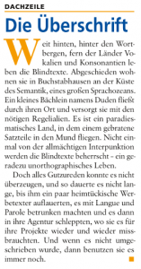
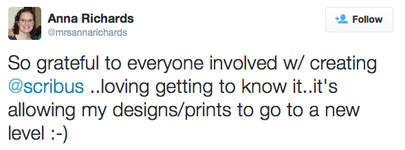
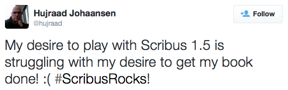
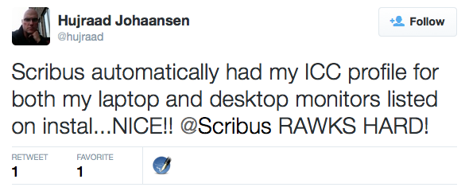
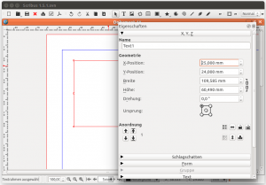
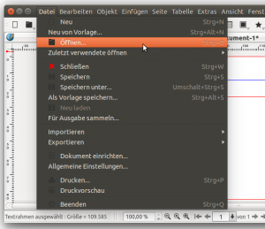
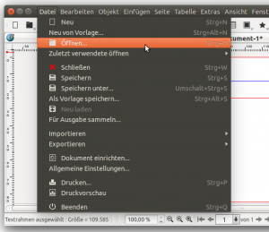

# The Scribus Community Newsletter, November 2015

## Kicker

The _kicker_ is a typical design element used in newspapers: a row above the headline in a small font defining the thematic placement of the article, typically followed by a line of the same width as the article. In the screenshot you see a single-column example.

Unfortunately, Scribus does not provide a specific function for drawing the line below the kicker. Of course you can just draw a line, but there is a workaround, that is faster.

Some experiments have lead to the following trick:

1. First lay out the kicker itself and create a specific paragraph style for it.
2. Below the kicker, insert a new paragraph containing a single white space. Then create a new paragraph style: use a very small line spacing (3pt in my example), set the text alignment to "forced justified" and underline the text; with a long click on the "Underline" button you can define the thickness, the margin and the color for the underline.  Finally, apply the new style to to the "empty" paragraph. (_Important_: If you have text control characters enabled, you won't see the line; disable the rendering of the text control characters in "View > Show control characters" to the line.)

The trick works by scaling a single underlined white space to the width of the text frame.

Thought this technique is outside the box, it works.

This contribution was first published by Manutius in [the German Scribus forum](http://scribus-user.de/forum).

## Testimonials

## Feedback from the Community

### Issues with new icons on dark background

The new set of icons we have have presented last month has generated much interest. During his tests on Ubuntu, Julius noticed an issue when the icons are rendered on the menus dark background:

Being involved in the german community on [scribus-user.de](http://scribus-user.de/forum/) he has [started a discussion](http://www.scribus-user.de/forum/viewtopic.php?f=24&t=209) that we want to share with you.

A possible solution would be to create a matching "light" icon set. But that one will not render well in the light gray toolbar. It would mean that two different icons set should be loaded in parallel (mockup created with GIMP)

Another option would be to colorize the icons with the same color as the text at runtime for each menu and toolbar item. With the rather monochromatic new icons this would be theoretically possible).

It is very open if and how this is to be achieved...

If you have some further feedback, and  your German is good enough, you can participate to the discussion [in the forum](<http://www.scribus-user.de/forum/viewtopic.php?f=24&t=209&p=1337&hilit=icons#p1337>), Otherwise, you can start a new thread in one of the Scribus communication channels.

## Short News

- Scribus 1.5svn got support for loading Quark Express XTG tagged file into text frames.
- Scribus 1.5svn can now load RTF files into text frames.
- Several fixes have been applied to make sure that whole user interface gets translated when switching language.
- The House of Open Source project has started: at the Oman University a group of students are working for three months on Scribus. They are mentored by [@khaledhosny](https://github.com/khaledhosny) and the main goal is to improve the support for the Arabic language in Scribus. They've also helped with fixing some 1.5.1svn bugs which we are very appreciative about. 

## Events

### Scribus at the Swiss Publishing Days

From November 4 to 6, Scribus team member Christoph Schäfer will be at the Swiss Publishing Days in Bern, Switzerland.

With Beat Kipfer and Holger Everding he will be preseting three conferences on libre graphics topics:

- Scribus, Gimp, Inkscape & Co.: Was taugen sie als Alternative zur Adobe CC?
- Cui bono? Die Crux undokumentierter Gra kformate
- FreieFarbe/FreeColour – Farbe(n) ohne Fesseln

For more information (and prices!) check the conference website: <http://swiss-publishing-week.ch/>

### Makerday 14. November 2015 in der Stadtbibliothek Winterthur (Schweiz)

On November 14, the public library in Winterthur will transform into a market place for ideas and knowledge. A part of the rich program will be dedicated to Scribus and the other libre graphics tools:

10:30 Erstellung von E-Books  
12:30 Scribus  
13:30 GIMP  
15:30 Inkscape

For more information check the library website: <http://bibliotheken.winterthur.ch/stadtbibliothek/veranstaltungen/makerday/>.

## Requests for participation

### UI devroom at FOSDEM 2016

FOSDEM is one of the biggest open source conferences. For the second time there will be a dedicated Open Source Design track. 

Lately, there have been several very relevant advances in the Scribus user interface: a [new icon set has been added to Scribus 1.5svn](https://github.com/aoloe/scribus-newsletter/blob/master/content/2015-10/2015-10.md#a-new-icon-set) by Dezso Markon that we covered previously. Another is the [IndigoUI project](http://forums.scribus.net/index.php/topic,1617.0.html), in which Martin is creating an interactive proposal for updating the Properties Palette and the Toolbar.

For the UI designers wanting to get together and talk about Scribus' user interface, this year's FOSDEM might be the place to be!  

Dead line for submitting your proposals is December 1st 2015.

For submissions and more information see the [Open Source Design website](http://opensourcedesign.net/events/design/hack/meeting/2016/01/30/opensourcedesign-fosdem.html)

### Cookies Recipes

At the end of December many people make special things related to the New Year or for some it's the Christmas holiday. One of the most popular traditions in some countries is to bake cookies. 

We want to invite you to share you're preferred cookies recipe with us by creating a "fiche" in A5 format (or a similar US format like 5x7) using Scribus and share both the PDF and the Scribus project file with us. 

You can discuss this challenge by participation in the [Cookies challenge thread](http://forums.scribus.net/index.php/topic,1868.0.html) in the Scribus forums. You may upload your work directly to the [forum thread](http://forums.scribus.net/index.php/topic,1868.0.html) or if you prefer to use your own server, filesharing service etc... whatever the case, share the address with us. We encourage you to release your work under cc-by-sa, public domain, or otherwise free.

## Code Activity

Would you appreciate seeing what has happened in the previous month to the scribus code? We aren't sure wether publishing this list in the newsletter is the best way, but we would like to hear your feedback

### v1.4.6

0013471 (Language)        Fix for broken hyphenation language selection  
0013435 (Import)          Blend modes not imported from SVG file  
0013451 (PDF)             Invalid PDF when specifying a non-existing page to export  
0013416 (Usability)       Assert failure when loading document  
0013407 (Translation)     Polish translation update for Scribus 1.4.6  
0013404 (Translation)     Updated Danish Translation  

### v1.5.1svn
0013401 (Usability)       [PATCH] Save CTRL+S is broken when in Masterpage Edit mode  
0013414 (User Interface)  [CLI] `--lang` issues  
0013413 (User Interface)  [CLI] Error-message-wrong-and-too-verbose  
0013408 (User Interface)  [CLI] `--prefs` option without provided file causes crash  
0013485 (OS-MacOSX)       [OSX] ⌘ should substitute CTRL in the keyboard shortcuts (Icons, Shortcut menu etc...)  
0013455 (OS-MacOSX)       Styles Menu Paragraph Style Effects Bullet menu UI anomaly  
0013493 (General)         Minor typo in scribusapp.cpp  
0013415 (User Interface)  [CLI] Changing multiple flag rules  
0013477 (Translation)     Updated Danish Translation  
0013472 (Build System)    [PATCH] Add OSX build option to travis-ci  
0013467 (General)         crash when deleting footnote's frame  
0013463 (Build System)    Add apt-get install -y to .travis.yml  
0013456 (Translation)     Script Menu Non-switching translations  
0013459 (Translation)     Align and Distribute non-switching translations  
0013458 (Translation)     Note Styles editor non-switching translations  
0013457 (Translation)     Marks Manager non-switching translations  
0013429 (Translation)     Polish translation update for Scribus 1.5.1  
0013444 (Translation)     Styles Menu non-switching translations  
0013441 (Translation)     Scrapbook Non-switching translations  
0013442 (Translation)     Layer Box Non-switching translations  
0013440 (NLS)             Impossible to select some language translation  
0013431 (Usability)       Trying to delete page of .sla generated from Scribus v.1.3.8 will hang Scribus 1.5.1  
0013427 (Build System)    Patch to consistently use -fPIC  
0013393 (General)         Edit > Duplicate changes relative levels of selected items  
0013406 (Import)          Paragraph Styles are not being imported from RTF files  
0013405 (Import)          Crash during RTF import  
0013392 (General)         Precisense of `LC_ALL`, `LANG` and `LC_MESSAGES` does not comply to POSIX  

## About this newsletter

This is a Scribus newsletter published by contributors from the Scribus community.
Our goal is to produce one issue per month presenting different aspects of the life in the Scribus community.

The October issue has been written by Ale, Julius and Kunda

You can contribute through our Github repository <https://github.com/aoloe/scribus-newsletter> or by getting in touch with us in any way you see fit ([forum](http://forums.scribus.net), [IRC](http://webchat.freenode.net/?channels=scribus), [mailing list](http://lists.scribus.net), [twitter](https://twitter.com/scribus), email, ...)

Currently we are looking for more redactors, translators, and a graphic designer who proposes a nice HTML style for this newsletter.  
We would also like to see designers create a PDF version of each issue.

You can also ask us to cover specific topics, by commenting on the [ticket for the next issue](https://github.com/aoloe/scribus-newsletter/issues/14)).

This newsletter is published under a Creative Common license:  
CC-BY-SA, the Scribus Community Newsletter (<http://impagina.org/newsletter>)
